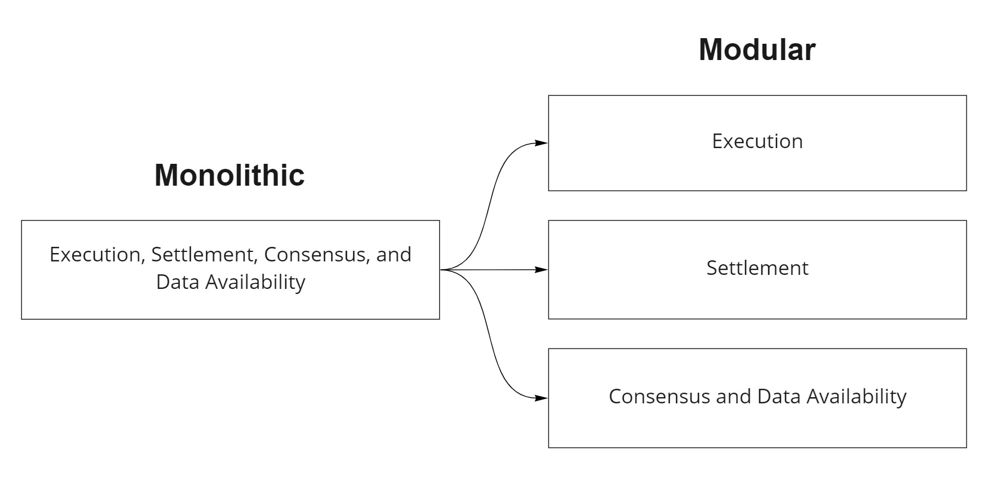

# Modular Blockchains

The idea behind modular blockchains is that the monolithic approach to having everying under the layer 1 umbrella does not scale well. So architects have progressed with sharding and layer 2 to help scale.

Modular blockchains are supposedly the next iteration by splitting up its processes among multiple specialized layers. Ideally creating a more optimal system that is sovereign, scalable, and secure.

## Modular Design

Divide the system into smaller parts that can be independently created or exchanged between different systems. 

A modular blockchain specializes in only a few functions and then can be arranged in a stack that combines to achieve the same functions as a monolithic chain.

**Modular Functions**

- Execution: processes transactions
- Settlement: dispute resolution and bridge
- Consensus: order transactions
- Data availability: ensures data is available

Rollups were the first implementation of this stack. They specialize in execution, off-loading settlement, consensus, and data vailability to separate layers.

## Monolithic blockchains

**Monolithic Constraints**

- Inefficient transaction verification: nodes must re-execute tx to check validity
- Resource constraints: the blockchain is bound by the resource capacity of its nodes
- Scalability: increasing throughput sacrifices security or decentralization to some degree

## Benefits of Modular Blockchains

- Sovereignty
- Launching new blockchains
- Scalability

## Conclusion

Modular blockchains are a new dynamic that facilitates scalability and bootstrapping of new blockchains while preserving their sovereignty.

- Modular stack consists of layers of specialized blockchains that work together to make a complete system
- Monolithic blockchains are limited by handling all functions on a single layer, increasing throughput sacrifices security or decentralization to some degree
- There are many potential benefits to modularizing: creating new blockchains, sovereignty, and scalability

## Sources

[Basics of modular blockchains](https://celestia.org/learn/basics-of-modular-blockchains)
