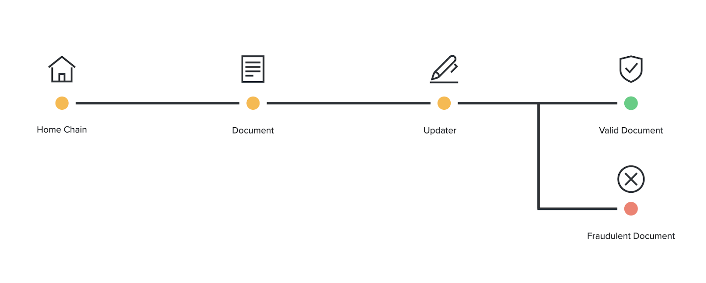

```
    ___       ___       ___       ___       ___   
   /\__\     /\  \     /\__\     /\  \     /\  \  
  /:| _|_   /::\  \   /::L_L_   /::\  \   /::\  \ 
 /::|/\__\ /:/\:\__\ /:/L:\__\ /::\:\__\ /:/\:\__\
 \/|::/  / \:\/:/  / \/_/:/  / \/\::/  / \:\/:/  /
   |:/  /   \::/  /    /:/  /    /:/  /   \::/  / 
   \/__/     \/__/     \/__/     \/__/     \/__/  
```
# NOMAD PROTOCOL

Nomad will form the base layer of a cross-chain communication network that provides fast, cheap communication for all smart contract chains and rollups. 

## Analogy: Notary Serivce



- The sending (home chain) produces a series of documents (messages) that need notarization.
- A notary (updater) is contracted to sign it.
- The notary (updater) can produce a fraudulent copy, but they will be punished by having their bond and license publicly revoked. Everyone relying on the notary learns that the notary is malicious.

## How does it work?

Its patterned after optimistic systems, so that means it follows the happy path, unless someone points out an issue.

It sees an attestation of some data and accepts it as valid after a timer elapses. Before the timer ends, honest participants have a chance to respond to the attestation and/or submit fraud proofs.

Nomad spans multiple chains. The sending chain is the source of truth, and contains the "Home" contract where messages are enqueued. (so does that mean messages only send one way? that can't be right...)


Guarantees:

- Fraud is costly
- All users can learn about fraud
- All users can block a fraudulent message before they are accepted

Instead of relying on a globally verifiable fraud-proof, Nomad relies on local verification by participants. The saves 90% on gas fees compared to pessimistic relays, while maintaining a high degree of security. It's a DON'T TRUST. VERIFY. type system.

## SOURCES

- https://docs.nomad.xyz/
