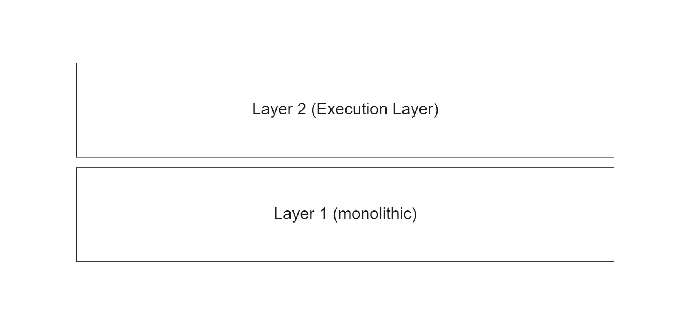
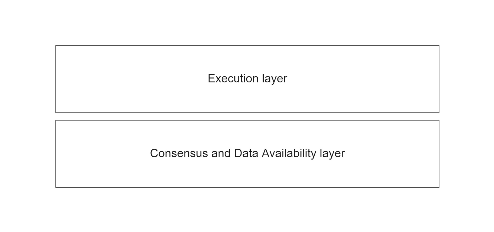

# Modular Architectures

## The modular blockchain stack

- Execution: the enviornment where applications live and state changes are executed
- Settlement: provides an optional hub for execution layers to verify proofs, resolve fraud disputes, and bridge between other execution layers
- Consensus: agree on the ordering of transactions
- Data availability: verifies that transaction data is available

## Layer 1 & layer 2

Layer 1 provids all key functions, including execution, while layer 2 specializes only in execution.

Layer 2 consists of different designs (rollups, state channels, or plasma), but it boils down to an extension of layer 1. Essentailly layer 1 is a monolithic scale and layer 2 compresses the data, but is still dependent on layer 1's capacity.

## Execution & settlement & data availability

Decopling the functions across multiple layers such that each layer in the stack is modular.

- Execution layer sits at the top.
- The settlement layer decouples from the rest of the functions. The result is an execution chain that can be used for settlement, enabling a trust minimized minimized bridge between the execution and settlement layer.
- Transaction data is pushed by the settlement layer to the bottom layer, rather than the contents of the entir block.

## Execution & data availability

This architecture doesn't have a settlement layer.

Since there is no settlement layer involved, only the data availability layer is responsible for providing security for transaction ordering and data availibility.

## Sources

[Modular architecutres](https://celestia.org/learn/modular-architectures/)
